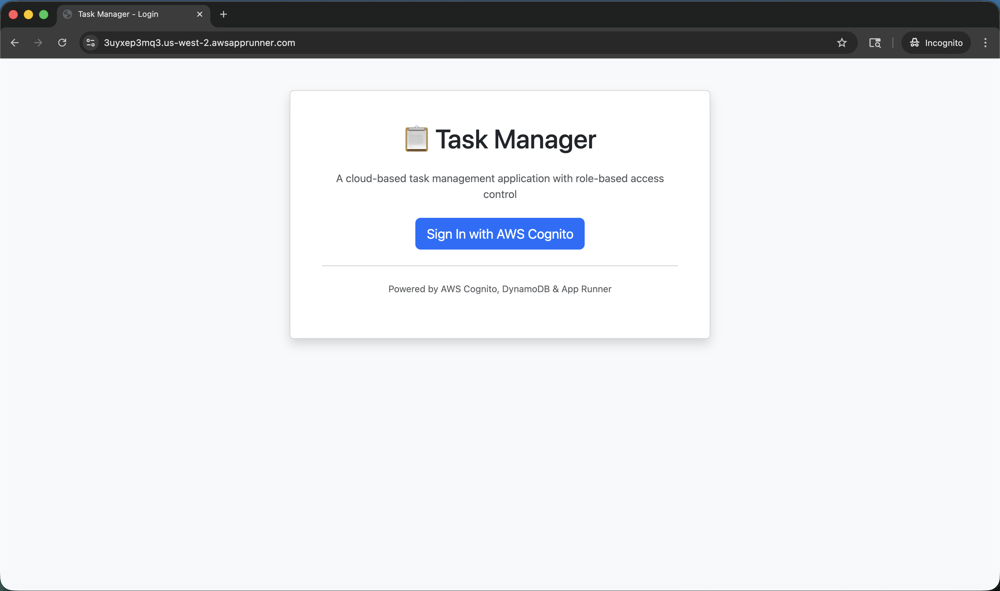
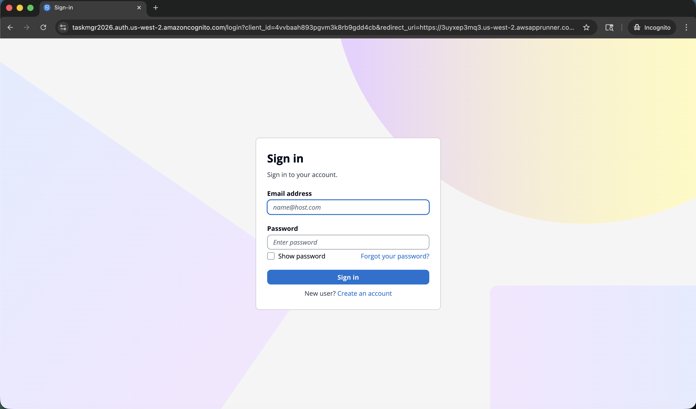
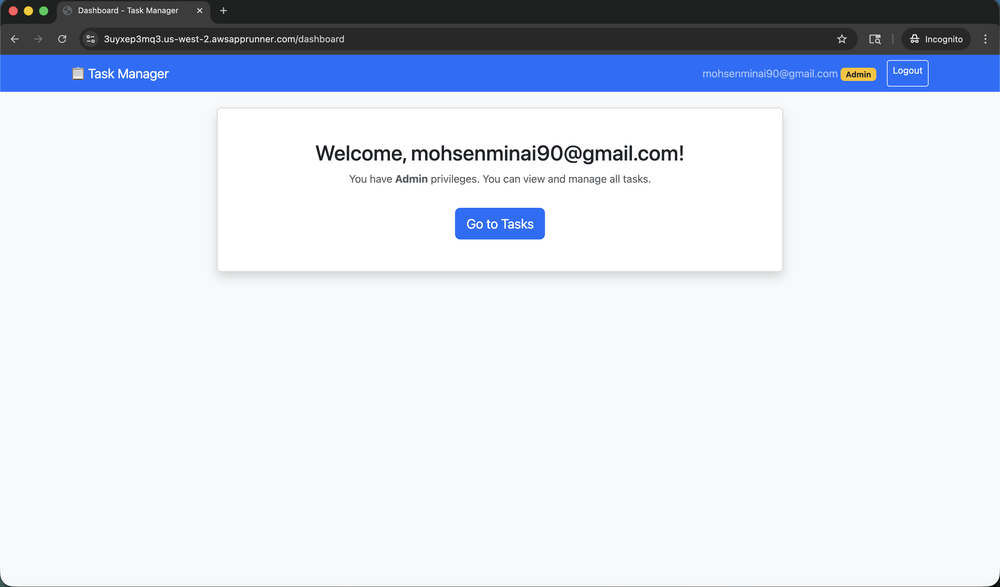
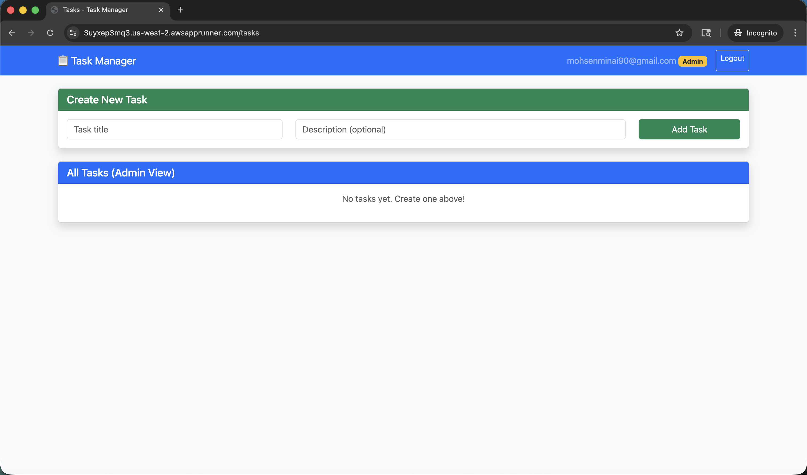
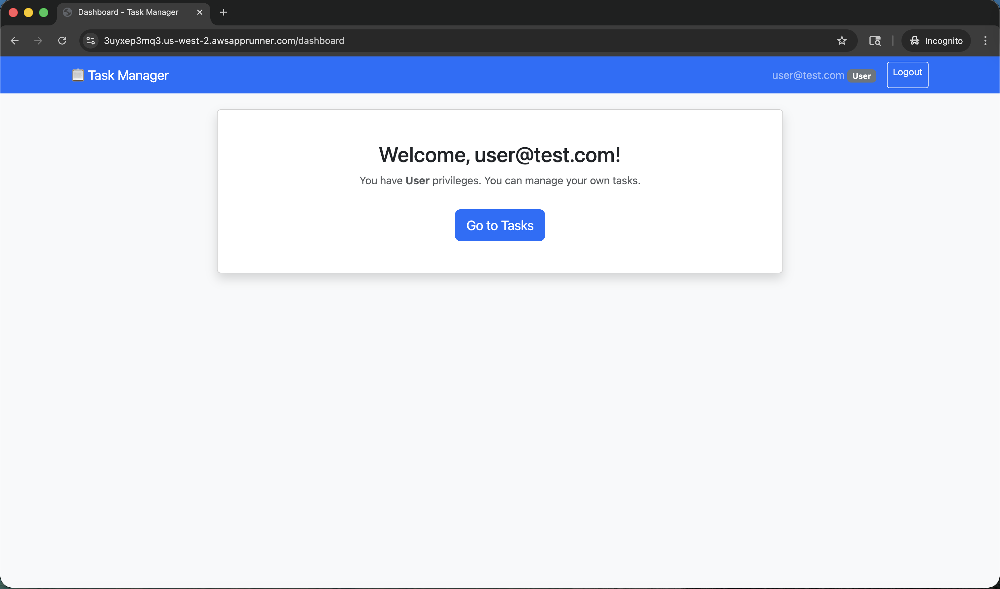
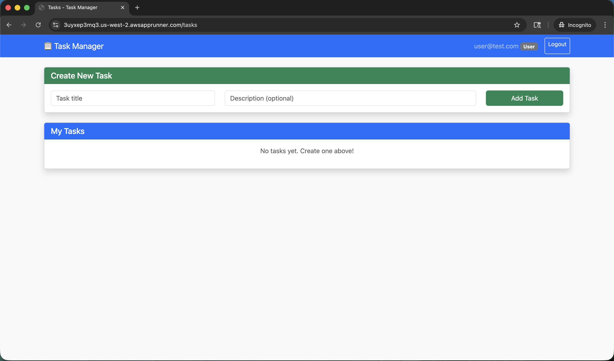
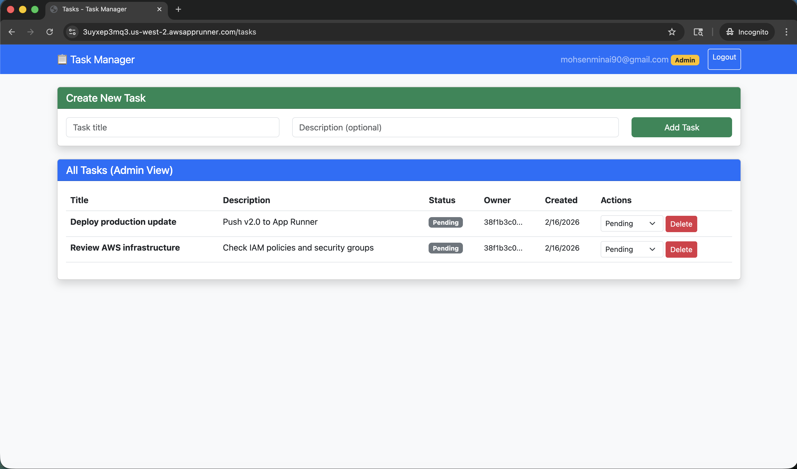

# Task Manager with AWS Cognito RBAC

A cloud-based task management application with role-based access control (RBAC) using AWS Cognito for authentication.

## 🚀 Live Demo
**URL:** https://3uyxep3mq3.us-west-2.awsapprunner.com

## 📋 Features
- **User Authentication** via AWS Cognito Hosted UI
- **Role-Based Access Control (RBAC)**
  - **Admin**: Can view and manage all tasks from all users
  - **User**: Can only view and manage their own tasks
- **Task Management**: Create, update status, and delete tasks
- **Cloud Deployment** on AWS App Runner with auto-scaling

## 🛠️ Tech Stack
- **Backend:** Node.js, Express.js
- **Frontend:** EJS Templates, Bootstrap 5
- **Authentication:** AWS Cognito (OAuth 2.0)
- **Database:** AWS DynamoDB
- **Deployment:** AWS App Runner (containerized with Docker)
- **Container Registry:** Amazon ECR

## 📸 Screenshots

### Home Page


### AWS Cognito Sign-In


### Admin Dashboard


### Admin Tasks View
*Admin can see all tasks from all users*


### User Dashboard


### User Tasks View
*Regular users can only see their own tasks*


### Task Creation Example


## 🏗️ Architecture

```
┌─────────────┐     ┌─────────────────┐     ┌─────────────┐
│   Browser   │────▶│   App Runner    │────▶│  DynamoDB   │
└─────────────┘     └─────────────────┘     └─────────────┘
       │                    │
       │                    │
       ▼                    ▼
┌─────────────────────────────────────┐
│         AWS Cognito User Pool       │
│   (Authentication & Authorization)  │
└─────────────────────────────────────┘
```

## 🔐 Role-Based Access Control

| Feature | Admin | Regular User |
|---------|-------|--------------|
| View own tasks | ✅ | ✅ |
| Create tasks | ✅ | ✅ |
| Update own tasks | ✅ | ✅ |
| Delete own tasks | ✅ | ✅ |
| View ALL tasks | ✅ | ❌ |
| Update ANY task | ✅ | ❌ |
| Delete ANY task | ✅ | ❌ |

## 📦 Project Structure
```
task-manager/
├── app.js                 # Main Express application
├── config/
│   └── cognito.js         # Cognito configuration
├── middleware/
│   └── auth.js            # Authentication middleware
├── routes/
│   ├── auth.js            # Login/logout routes
│   └── tasks.js           # Task CRUD routes
├── services/
│   └── dynamodb.js        # DynamoDB operations
├── views/
│   ├── login.ejs          # Login page
│   ├── dashboard.ejs      # Dashboard page
│   └── tasks.ejs          # Tasks page
├── dockerfile             # Docker configuration
└── package.json
```

## 🚀 Deployment

This application is deployed on AWS App Runner, which provides:
- **Auto-scaling**: Automatically scales from 1-25 instances based on traffic
- **Zero downtime deployments**
- **Built-in load balancing
- **HTTPS by default**

## 📄 License
This project was created for SJSU coursework.
